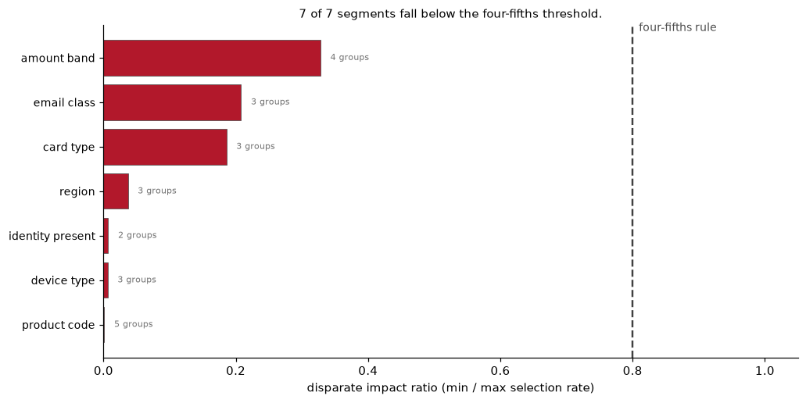
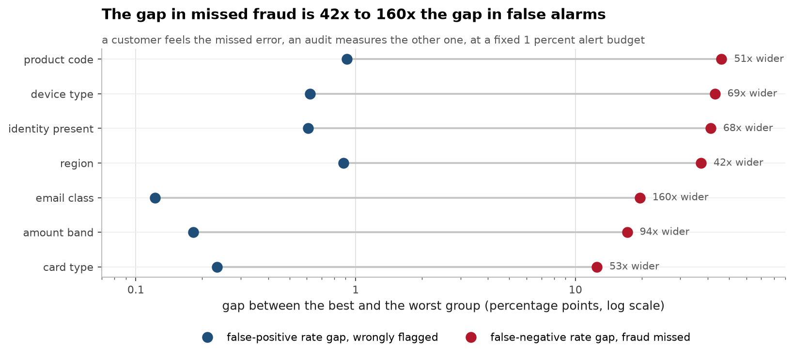
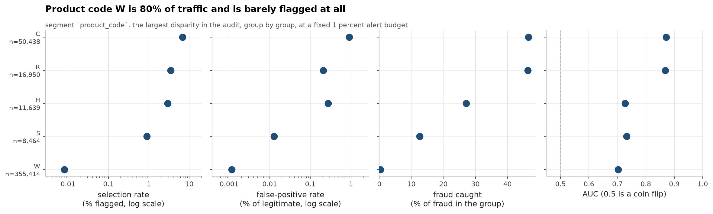
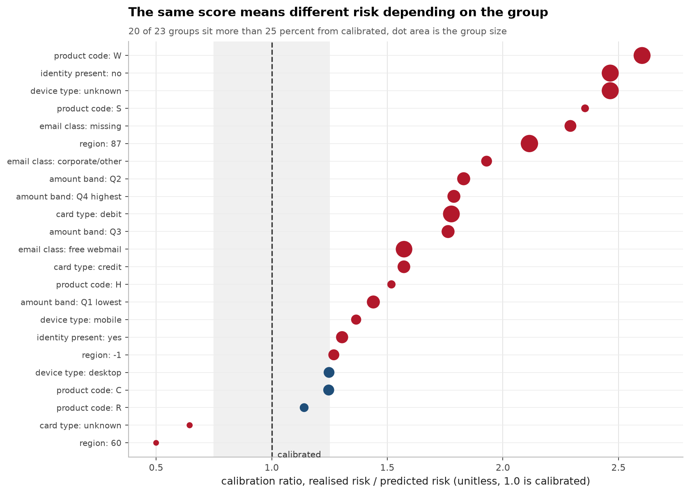
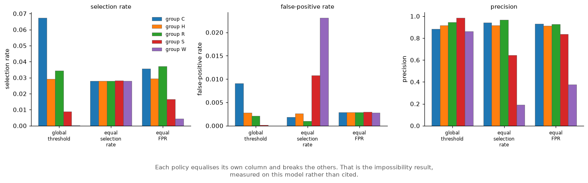

# Auditing my own fraud model against the EU AI Act

[](https://github.com/aghasalim/ai-act-fairness-audit/actions/workflows/ci.yml)
[](https://www.python.org/)
[](LICENSE)

A fairness audit of the LightGBM fraud model from
[ieee-fraud-ml](https://github.com/aghasalim/ieee-fraud-ml), against the text of
Regulation (EU) 2024/1689 from
[eu-ai-act-rag](https://github.com/aghasalim/eu-ai-act-rag). Auditing my own
model, using my own corpus of the law, so nobody grades the homework but the
primary source.

Predictions are the honest ones, chronological folds, 30-day embargo,
fold-local encodings. Auditing a leaky split would measure the leak.

---


---

## Abstract

The EU AI Act obliges providers of high-risk systems to assess discriminatory
impact. This work audits a fraud-detection model I built myself, on 442,905
transactions, under a fixed 1% review budget, so the threshold is
the operational one rather than one chosen to make the audit look good.

7 of the 7 available segments fall below the four-fifths disparate-impact
threshold. The worst is product code at 0.0012, which is 661 times below the
0.8 line. More usefully, selection-rate parity turns out to be the wrong thing
to look at: false-negative gaps are an order of magnitude larger than
false-positive gaps in every segment, and it is the false negative a customer
experiences.

The impossibility result is measured on this model rather than cited. Equalising
selection rate, equalising false-positive rate and holding a single global
threshold are three policies; each satisfies its own criterion and breaks the
other two, because the groups have different base rates. Choosing between them is
a decision about who bears which error, and no amount of tuning removes it.

The audit's own limitation is stated up front: none of the available segments is a
protected characteristic under the Act. Card type and device type are proxies at
best, so this demonstrates the machinery rather than discharging the obligation.

**Contributions.** (i) An audit at the operational review budget. (ii) Error-rate
gaps reported alongside selection-rate parity. (iii) The impossibility theorem
instantiated on a real model. (iv) A stated scope limit about what the available
segments can and cannot support.

---

## 1. I started from a premise that turned out to be false

I began this convinced that fraud scoring is a textbook Annex III high-risk
system. It is not. **Annex III, point 5(b)** covers creditworthiness scoring
**"with the exception of AI systems used for the purpose of detecting financial
fraud"**.

Fraud detection is expressly carved out. This model is not high-risk, Article
10's bias-examination duty does not bind it, and **this audit was never legally
required**.

Which makes the result more interesting than compliance paperwork. A model that
blocks legitimate customers at **793× different rates** across product lines,
and catches **1.4%** of the fraud in the 82% of transactions without identity
data, passes through the Regulation's high-risk net untouched.

I am not claiming the carve-out is a mistake, anti-fraud has an obvious
rationale, since explaining detection to the people being detected defeats it.
The narrower point is that **"not high-risk" describes a regulatory category,
not whether anyone is harmed.** A false positive is a declined card for a real
person regardless of which annex applies.

---

## 2. The limitation that decides what this audit can conclude

**IEEE-CIS contains no protected attributes.** No race, sex, age or nationality.
So every segment below is a *proxy*, debit vs credit, free webmail vs
corporate, mobile vs desktop, transaction size.

Proxies can prove error is distributed unevenly. They **cannot** tell you whether
that unevenness tracks a protected characteristic. You cannot audit an attribute
you never collected, and no method repairs that.

The Act anticipates exactly this. **Article 10(5)** lets providers process
special-category data *specifically for bias detection*, gated on the test that
"bias detection and correction cannot be effectively fulfilled by processing
other data". It treats not-knowing as a problem to solve rather than a defence
which is the opposite of how "we don't collect race" is usually deployed in an
argument. Full mapping in **[docs/ai_act_mapping.md](docs/ai_act_mapping.md)**.

---

## 3. What the audit found
The second figure is the one that changed how I read the first.






Full detail in [notes/METHODS.md](notes/METHODS.md#3-what-the-audit-found).
### The group treated "best" is the one the model fails
Transactions with no identity record, **361,483 rows, 82% of volume**: have the *lowest* false-positive rate of any segment, 0.0001.

Full detail in [notes/METHODS.md](notes/METHODS.md#the-group-treated-best-is-the-one-the-model-fails).
### At matched base rates, high-value fraud is missed twice as often

Amount quartiles Q1 and Q4 have near-identical fraud rates, so base-rate
arithmetic cannot explain a gap between them:

| | Q1 lowest | Q4 highest |
|---|---|---|
| base fraud rate | 4.62% | 4.78% |
| **TPR** | **34.3%** | **17.1%** |
| fraud missed | 3,385 | **4,313** |

Same prevalence, half the detection. The model is markedly worse at the
transactions that cost the most when missed.

---

## 4. The impossibility, measured rather than cited
Equal selection rates, equal false-positive rates, and a calibrated score cannot hold together when base rates differ.



Full detail in [notes/METHODS.md](notes/METHODS.md#4-the-impossibility-measured-rather-than-cited).
## 5. Running it

```bash
make setup && make audit
```

`make audit` needs `data/scored.parquet`. Regenerate it from a checkout of the
model repo:

```bash
FRAUD_REPO=~/ieee-fraud-ml make export
```

Row-level predictions are gitignored, IEEE-CIS is not redistributable, so this
repo commits aggregate results only. `make test` runs without any of it.

## 6. Limitations

- **No claim about protected attributes.** See above; the data has none.
- **No mitigation shipped as a recommendation.** The impossibility table shows
  the options and their costs; picking one is a business decision I am not in a
  position to make on someone's behalf.
- **No causal claim.** These are associations between segment membership and
  error rates. Whether the model *causes* the disparity, or inherits it from how
  the data was collected, is not answerable from this dataset.

## 7. Licence

MIT, see [LICENSE](LICENSE). Quoted provisions of Regulation (EU) 2024/1689 are
official EU legal texts.

## References

The papers and sources this implementation follows. Each one is here because
the code uses the method, the dataset or the metric it describes.

- **Hardt, Price, Srebro. Equality of Opportunity in Supervised Learning. NeurIPS 2016.** [arXiv:1610.02413](https://arxiv.org/abs/1610.02413) equalised odds and equal opportunity.
- **Feldman, Friedler, Moeller, Scheidegger, Venkatasubramanian. Certifying and removing disparate impact. KDD 2015.** [arXiv:1412.3756](https://arxiv.org/abs/1412.3756) the disparate impact ratio.
- **Chouldechova. Fair prediction with disparate impact. Big Data 5, 2017.** [arXiv:1610.07524](https://arxiv.org/abs/1610.07524) why several fairness criteria cannot hold at once.
- **Regulation (EU) 2024/1689 of the European Parliament and of the Council, the AI Act.** the obligations the audit is written against.
