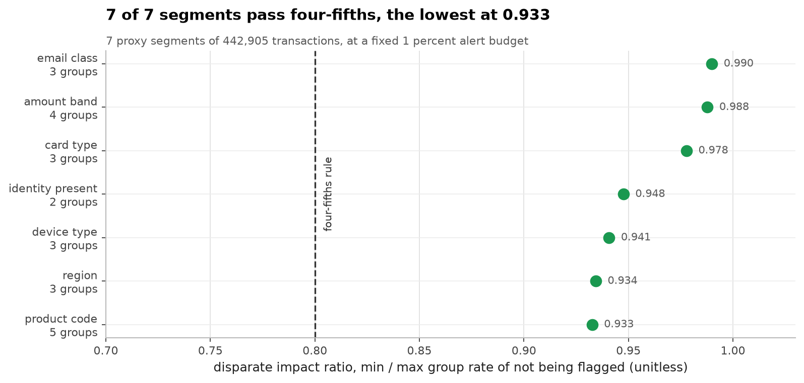
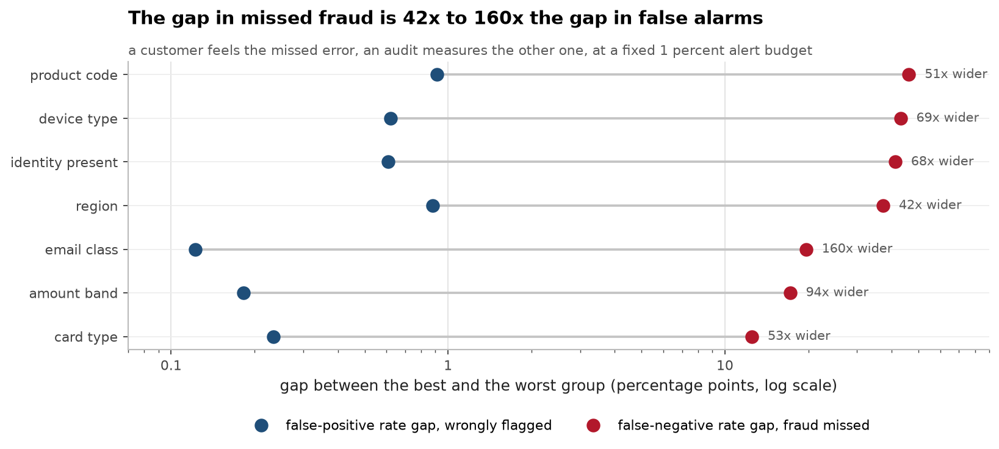
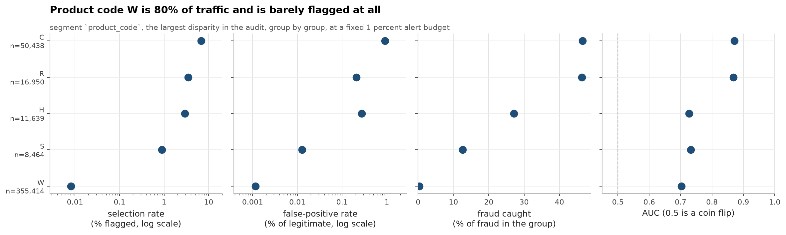
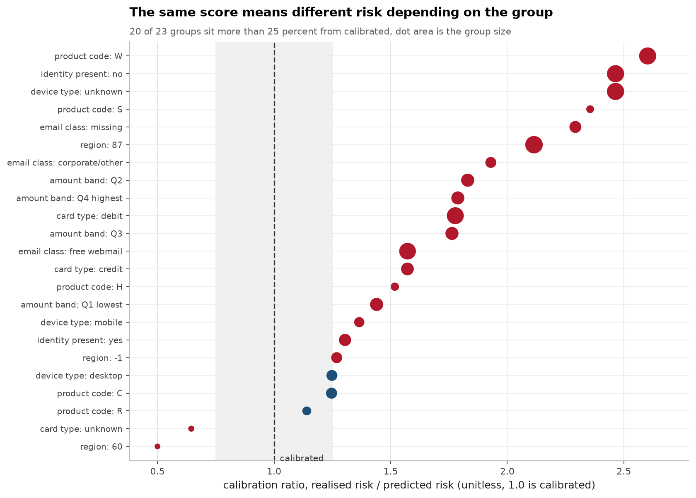
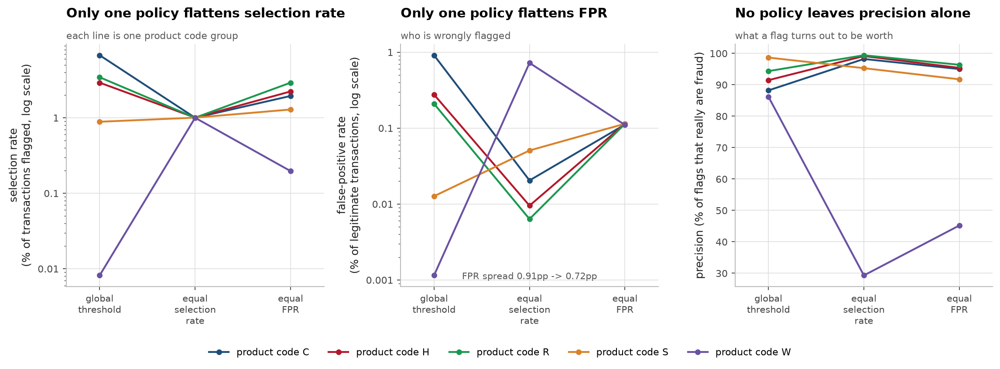

# Auditing my own fraud model against the EU AI Act

[](https://github.com/aghasalim/ai-act-fairness-audit/actions/workflows/ci.yml)
[](https://www.python.org/)
[](LICENSE)
[](https://doi.org/10.5281/zenodo.23003608)

This is a fairness audit of the LightGBM fraud model from
[ieee-fraud-ml](https://github.com/aghasalim/ieee-fraud-ml). I checked it against the text of
Regulation (EU) 2024/1689 from
[eu-ai-act-rag](https://github.com/aghasalim/eu-ai-act-rag). It's my own model,
audited with my own corpus of the law, so the only thing grading the homework is
the primary source.

> **Scope**  442,905 scored transactions · 1% alert budget · 7 proxy segments ·
> no protected attribute present in the data · model not legally high-risk

Predictions come from the leak-free setup. That means chronological folds with a
30-day embargo, and encodings fitted inside each fold. If I audited a leaky split
I'd just be measuring the leak. Independent programs in `verify/` recompute every
number published here from the committed segment tables. CI fails the build if
any of them disagrees.

---

## The premise I opened with was wrong

When I started, I was sure fraud scoring was a textbook Annex III high-risk
system. It isn't. Annex III, point 5(b) covers creditworthiness scoring
"with the exception of AI systems used for the purpose of detecting financial
fraud".

So fraud detection is carved out on purpose. This model isn't high-risk, and
Article 10's bias-examination duty doesn't bind it. This audit was never legally
required.

I find that more interesting than compliance paperwork would have been. The model
blocks legitimate customers at 793× different rates across product lines. It
catches **1.4%** of the fraud in the 82% of transactions without identity data.
And it still passes through the Regulation's high-risk net untouched.

I'm not saying the carve-out is a mistake. Anti-fraud has an obvious reason for
it, since explaining detection to the people being detected defeats it. My point
is narrower. "Not high-risk" names a regulatory category, and it says nothing
about whether anyone gets hurt. A false positive is still a declined card for a
real person, whichever annex applies.

## What the segments can and cannot support

IEEE-CIS has no protected attributes. There's no race, sex, age or nationality.
So every segment below is a *proxy*, like debit vs credit, free webmail vs
corporate, mobile vs desktop, or transaction size.

Proxies can show that error is spread unevenly. They can't tell you whether that
unevenness follows a protected characteristic. You can't audit an attribute you
never collected, and no method fixes that. So what's here shows the machinery
working without discharging anyone's obligation, and I'd rather say so before
the numbers.

The Act sees this coming. Article 10(5) lets providers process special-category
data *specifically for bias detection*. The condition is that "bias detection and
correction cannot be effectively fulfilled by processing other data". So it
treats not knowing as a problem to solve. That's the opposite of how "we don't
collect race" usually gets used in an argument. The full mapping is in
[docs/ai_act_mapping.md](docs/ai_act_mapping.md).

---

## Finding 1: everything passes four-fifths, and that says little

I ran the audit on 442,905 transactions under a fixed 1% review budget. That's
the threshold the model actually operates at. The four-fifths rule compares rates
of the favourable outcome, which here means not being flagged. At that budget,
7 of the 7 available segments pass the four-fifths disparate-impact threshold.
The lowest is product code at 0.9326. That means 93.3% of product C transactions
go through unflagged, against 99.99% for product W.

That pass is close to automatic. With 1% of all traffic flagged, every group's
favourable rate stays above 90%. So the ratio can't fall far below 1, whatever
the model does to a group. Meanwhile the false-positive rate runs 793 times
higher for product C than for product W, and the rule can't see it. My first
version of this audit applied the rule to the flag rate itself, which is the
adverse outcome. It reported a ratio of 0.0012 and seven failures. I'd pointed
the rule the wrong way round.

Most of the FPR gap is plain arithmetic. It isn't discrimination. One global
threshold flags more of the groups that offend more, and base rates across
product codes run from 2.1% to 12.8%.

## Finding 2: the gap worth reading is the one nobody reports

In every segment, false-negative gaps are an order of magnitude larger than
false-positive gaps. That's 46.2 points against 0.9 points for product code.
Selection-rate parity is the wrong tool here. A false negative is a fraud that
went through on a customer's card. The customer is the one who has to spot it
and dispute it. The money usually comes back to them through a chargeback, so
the financial loss lands on the merchant or the card issuer.






Method and per-group tables: [notes/METHODS.md](notes/METHODS.md#3-what-the-audit-found).

## Finding 3: the best-treated group is the one the model abandons

Transactions with no identity record make up **361,483 rows, 82% of volume**.
They have a false-positive rate of 0.0001, 90 times lower than where identity is
present. That looks like the best-served group in the data, and it isn't. The
model catches **1.4%** of the fraud there against 42.6% where identity is
present, so **7,626** frauds go through. That's more in absolute terms than the
5,187 missed in the segment the model actually works on. The low false-positive
rate is just a model with nothing to say about 82% of its traffic.

Method and per-group tables: [notes/METHODS.md](notes/METHODS.md#the-group-treated-best-is-the-one-the-model-fails).

## Finding 4: at matched base rates, expensive fraud is missed twice as often

Amount quartiles Q1 and Q4 have nearly identical fraud rates, so base-rate
arithmetic can't explain a gap between them.

| | Q1 lowest | Q4 highest |
|---|---|---|
| base fraud rate | 4.62% | 4.78% |
| **TPR** | **34.3%** | **17.1%** |
| fraud missed | 3,385 | **4,313** |

The prevalence is the same and the detection rate is half. So the model is
clearly worse on the transactions that cost the most when it misses them.

## Finding 5: the impossibility, on this model rather than in a citation

When base rates differ, you can't have equal selection rates, equal
false-positive rates and a calibrated score all at once. I built all three
policies on product code and measured what each one costs at the same 1% review
budget. One global threshold leaves a **6.74pp** spread in selection rate and a
0.91pp spread in false-positive rate. Equalising selection rate closes the first
to 0.00pp and narrows the second to 0.72pp. The catch is that it moves reviews
from product C onto W, where only 29% of flags are fraud. It catches **1,904**
frauds instead of **3,962**. Equalising false-positive rate at the global
policy's pooled 0.11% reviews only 0.58% of transactions. It closes that gap to
0.00pp, leaves a 2.72pp selection spread and catches 2,074. Both equalising
policies need a different threshold per group. So the same score gets a
different decision depending on which group you're in.

Picking one means deciding who carries which error. No amount of tuning makes
that choice go away.



Method and per-group tables: [notes/METHODS.md](notes/METHODS.md#4-the-impossibility-measured-rather-than-cited).

---

## Rebuilding the audit

```bash
make setup && make audit
```

`make audit` needs `data/scored.parquet`. You can regenerate it from a checkout
of the model repo:

```bash
FRAUD_REPO=~/ieee-fraud-ml make export
```

Row-level predictions are gitignored and IEEE-CIS isn't redistributable, so this
repo only commits aggregate results. `make test` runs without any of it.

## Three things this audit does not establish

It says nothing about protected attributes. The data has none, and proxies don't
turn into one just because I measured them carefully.

It doesn't recommend a mitigation. The impossibility table shows the options and
what they cost. Picking one is a business decision, and I'm not in a position to
make it for someone else.

It makes no causal claim. These are associations between segment membership and
error rates. This dataset can't answer whether the model *causes* the disparity
or inherits it from how the data was collected.

MIT licensed, terms in [LICENSE](LICENSE). Quoted provisions of Regulation (EU)
2024/1689 are official EU legal texts.

## Sources

- **Hardt, Price, Srebro. Equality of Opportunity in Supervised Learning. NeurIPS 2016.** [arXiv:1610.02413](https://arxiv.org/abs/1610.02413) equalised odds and equal opportunity.
- **Feldman, Friedler, Moeller, Scheidegger, Venkatasubramanian. Certifying and removing disparate impact. KDD 2015.** [arXiv:1412.3756](https://arxiv.org/abs/1412.3756) the disparate impact ratio.
- **Chouldechova. Fair prediction with disparate impact. Big Data 5, 2017.** [arXiv:1610.07524](https://arxiv.org/abs/1610.07524) why several fairness criteria cannot hold at once.
- **Regulation (EU) 2024/1689 of the European Parliament and of the Council, the AI Act.** the obligations the audit is written against.
